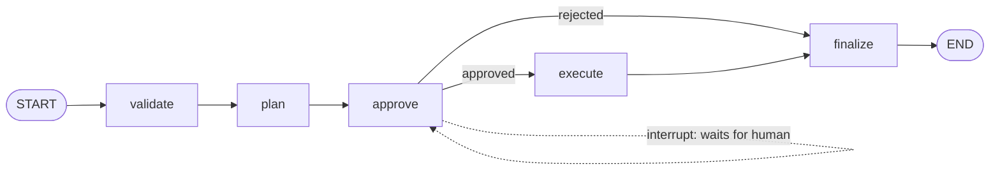

# LangGraph Task Agent

An AI task-planning agent built with [LangGraph](https://langchain-ai.github.io/langgraphjs/), with a **human-in-the-loop** approval gate: the agent drafts a plan, pauses, and waits for you to approve or reject it before executing anything.

- **Backend** — Express + TypeScript, a compiled LangGraph state graph, OpenAI via `@langchain/openai`
- **Frontend** — Next.js 16 (App Router) + React 19 + Tailwind v4 + shadcn/ui

---

## How it works

The core is a five-node state graph. After `plan`, the graph **interrupts** itself and the run is checkpointed — the HTTP request returns the draft plan and a `threadId`. A later call to `/agent/approve` resumes the exact same run from where it stopped.



| Node | File | Responsibility |
| --- | --- | --- |
| `validate` | `backend/src/graph/nodes/01_validate.ts` | Trims the input, truncates it to 300 chars, cancels the run on empty input |
| `plan` | `backend/src/graph/nodes/02_plan.ts` | Asks the model for a 3–5 step plan via `withStructuredOutput` (Zod-validated) |
| `approve` | `backend/src/graph/nodes/03_approve.ts` | Calls `interrupt()` — pauses the graph and surfaces the plan to the user |
| `execute` | `backend/src/graph/nodes/04_execute.ts` | Generates one short note per step, again as structured output |
| `finalize` | `backend/src/graph/nodes/05_finalize.ts` | Normalizes the terminal state into `done` / `cancelled` plus a human-readable message |

State shape lives in `backend/src/graph/types.ts` and is mirrored as a LangGraph `Annotation.Root` in `backend/src/graph/graph.ts`.

Checkpointing uses `MemorySaver`, so **runs live in process memory** — restarting the backend invalidates any pending `threadId`. Swap in a persistent checkpointer (SQLite/Postgres) if you need runs to survive restarts.

---

## Project structure

```
.
├── backend/
│   └── src/
│       ├── index.ts            # Express app, CORS, server bootstrap
│       ├── routes/graph.ts     # POST /agent, POST /agent/approve
│       ├── graph/
│       │   ├── graph.ts        # StateGraph wiring, runAgent / resumeAgent
│       │   ├── types.ts        # Zod state schema + initial state
│       │   └── nodes/          # 01_validate … 05_finalize
│       └── utils/env.ts        # Zod-validated environment config
└── client/
    └── src/
        ├── app/page.tsx        # Run orchestration (start → approve/reject)
        ├── components/task-agent/  # AgentForm, RunLogs
        ├── components/ui/      # shadcn/ui primitives
        └── lib/api.ts          # Typed fetch wrappers
```

---

## Getting started

### Prerequisites

- Node.js 20+
- An OpenAI API key

### 1. Backend

```bash
cd backend
npm install
```

Create `backend/.env`:

```env
OPENAI_API_KEY=sk-...
OPENAI_MODEL=gpt-4o-mini
PORT=5000
```

`OPENAI_MODEL` and `PORT` have defaults (`gpt-4o-mini`, `5000`); `OPENAI_API_KEY` is required — the process throws at startup without it.

```bash
npm run dev     # tsx watch, http://localhost:5000
```

### 2. Frontend

```bash
cd client
npm install
```

Create `client/.env`:

```env
NEXT_PUBLIC_API_URL=http://localhost:5000
```

```bash
npm run dev     # http://localhost:3000
```

The backend's CORS policy is hardcoded to `http://localhost:3000` (`backend/src/index.ts`) — change it there if you serve the client from another origin.

---

## API

### `POST /agent`

Start a run.

```json
{ "input": "Plan a weekend trip to Kraków" }
```

Responds with either a pending approval:

```json
{
  "status": "ok",
  "data": {
    "kind": "needs_approval",
    "interrupt": {
      "steps": ["Pick travel dates", "Book transport", "..."],
      "threadId": "t_m1k2x3_a9f0zq",
      "prompt": "Approve the generated plan to execute or reject to cancel"
    }
  }
}
```

…or a final state (when there was nothing to approve, e.g. validation cancelled the run).

### `POST /agent/approve`

Resume a paused run.

```json
{ "approve": true, "threadId": "t_m1k2x3_a9f0zq" }
```

```json
{
  "status": "ok",
  "data": {
    "kind": "final",
    "final": {
      "status": "done",
      "message": "Executed 4 steps",
      "steps": ["..."],
      "results": [{ "step": "Pick travel dates", "note": "..." }]
    }
  }
}
```

`approve: false` walks straight to `finalize` and returns `status: "cancelled"`.

Errors are uniform: `400` for schema violations, `500` otherwise, both shaped as `{ "status": "error", "errorMessage": "..." }`.

---

## Scripts

**backend**

| Command | Description |
| --- | --- |
| `npm run dev` | Start the dev server with `tsx watch` |
| `npm run lint` / `lint:fix` | ESLint (flat config, typescript-eslint + Prettier) |
| `npm run format` / `format:check` | Prettier |

**client**

| Command | Description |
| --- | --- |
| `npm run dev` | Next.js dev server |
| `npm run build` | Production build |
| `npm run start` | Serve the production build |

> There is no production build/start script for the backend yet — it currently runs through `tsx` in dev mode only.

---

## Notes & limitations

- Runs are stored in memory (`MemorySaver`); pending approvals are lost on restart.
- No auth — the API is open to anything allowed by CORS. Do not expose it publicly as-is.
- `execute` produces model-written notes per step; it does not call external tools or take real-world actions.
- Plans are capped at 5 steps, input at 300 characters.
